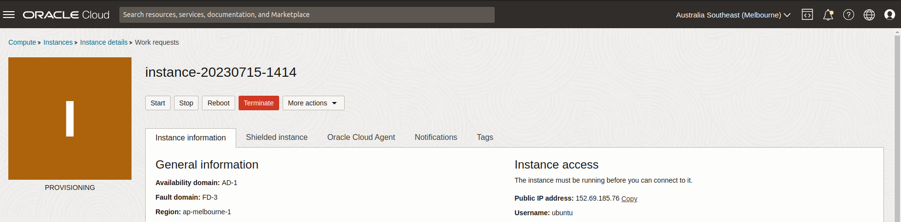

# Hack Me Light Bulb / O-Week

# Table of Contents

# Tech Used
- Cloud Provider (Oracle Cloud Used. others include; AWS, Google Cloud, IBM Cloud, Azure)
- LAMP Stack
    - Linux (Ubuntu Server 22.04.* LTS)
    - Apache
    - MySQL
    - PHP (8.1.2-1ubuntu2.13)
- [Tailwindcss](https://tailwindcss.com/docs/installation)
    - Page styling and use of prebuilt elements (table, header)
- [Cloudflare Turnstile](https://developers.cloudflare.com/turnstile/)
    - Captcha (stops someone from botting the player registration page)


# Production Install Guide
This guide will take you through setting up a web server to host a production ready version of the hack me light bulb demo.

### Some things you'll need to have setup / access to will be:
- A cloud provider account (This guide uses Oracle Cloud)
    - Even though this won't cost any money, be prepared to enter a debit/credit card for verification
- Access to a Domain Name and ability to access DNS Configuration

## Creating the Web Server

1. Within your cloud provider, create an web instance


2. Select Ubuntu as the image (22.04 is supported by security updates until April 2032)


3. (optional) For a free service with Oracle Cloud, change the shape to a Virtual Machine with Ampere Processor


4. Select CPUs & RAM (2022 - 2023 Server had 1 OCPU and 6GB of RAM)


5. Download both Private and Public SSH Keys (this will be used later for connecting to the server, DONT LOOSE THESE FILES)


6. Create Instance (rest of the default settings are fine, we want a public IP address)

7. Wait for instance to start



## Logging into the Web Server & Installing Required Software
1. Open up a terminal and with the IP address and username from the cloud provider
```
ssh username@IPADDRESS -i "PRIVATEKEYLOCATION.key"
```


2. Update the instance (updates everything and automatically says yes to all recommended updates)
```
sudo apt update && sudo apt upgrade -y
```
- sometimes a restart is required, type in ```reboot``` to restart


3. Install Apache2
```
sudo apt install apache2
```

4. View Firewall rules and allow apache through the firewall
```
sudo ufw app list
sudo ufw app info "Apache Full"
sudo ufw allow "Apache Full"
sudo ufw enable
```
5. Reboot Instance
```
sudo reboot
```

7. Wait a few mins for instance to start again
8. Try going to the IP address in the web browser (HTTP ONLY)

- you should see a page as show above
- don't proceed if you dont get this page
- could be problems with the firewall, apache2 not being installed correctly, firewall rules on the cloud provider

9. Install MySQL and start setup
```
sudo apt install mysql-server

sudo mysql_secure_installation
```

10. Go through the process of setting up MySQL, most questions are security based and different levels of security can be setup

11. Set a secure MySQL password that you can save and use later

12. Once setup finished, run ```sudo mysql``` and something like this should appear:
```
Welcome to the MySQL monitor.  Commands end with ; or \g.
Your MySQL connection id is 5
Server version: 5.7.34-0ubuntu0.18.04.1 (Ubuntu)

Copyright (c) 2000, 2021, Oracle and/or its affiliates.

Oracle is a registered trademark of Oracle Corporation and/or its
affiliates. Other names may be trademarks of their respective
owners.

Type 'help;' or '\h' for help. Type '\c' to clear the current input statement.

mysql> 
```

13. Type ```exit``` to exit

14. Install PHP
```
sudo apt install php libapache2-mod-php php-mysql
```

15. Changing Apache’s Directory Index
- you'll want to move index.php to the first entry in the line (see below)

```
<IfModule mod_dir.c>
    DirectoryIndex index.php index.html index.cgi index.pl index.xhtml index.htm
</IfModule>
```

```
sudo nano /etc/apache2/mods-enabled/dir.conf
```

16. Restart Apache
```
sudo systemctl restart apache2
```


# Development Guide


